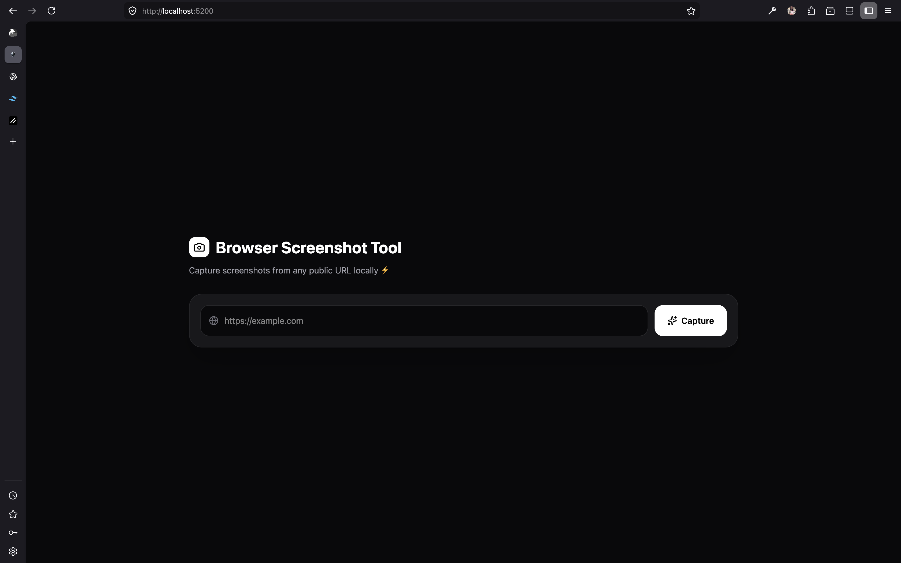
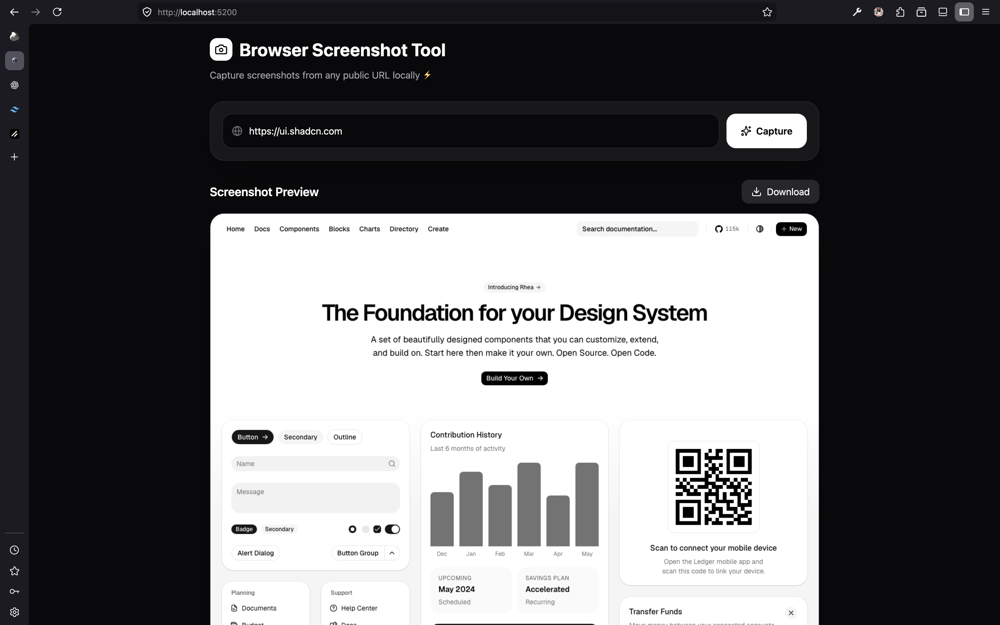

# Browser Screenshot App

Simple browser screenshot tool built with:

* ⚡ Bun native HTTP server
* 🎭 Playwright
* ⚛️ React + Vite
* 🎨 TailwindCSS
* 🧩 Lucide React icons

The project contains:

```txt
root/
 ├── api/   -> Bun + Playwright screenshot server
 ├── ui/    -> React frontend
 ├── screenone.png
 ├── screentwo.png
 └── README.md
```

---

# Preview

## UI Before Screenshot



---

## UI After Screenshot Response



---

# Features

* Capture website screenshots from URLs
* Fast Bun-based API server
* Simple React frontend
* Download screenshots directly
* Local development setup
* Minimal architecture

---

# Tech Stack

## Backend

* Bun
* Native Bun HTTP server
* Playwright

## Frontend

* React
* Vite
* TailwindCSS
* Lucide React

---

# Project Structure

```txt
api/
 ├── lib/         -> Screenshot logic
 ├── server.ts
 └── package.json

ui/
 ├── src/
 ├── public/
 └── package.json
```

---

# Running The API

The API server runs on:

```txt
http://localhost:3000
```

Before starting, make sure port `3000` is not already in use.

## Start API

Using Bun:

```bash
bun run start
```

Or using npm:

```bash
npm run start
```

---

# Running The UI

The UI runs on:

```txt
http://localhost:5200
```

## Start Development Server

Using Bun:

```bash
bun run dev
```

## Production Build

```bash
bun run build
```

---

# Example API Usage

```txt
http://localhost:3000/?url=https://example.com
```

Example:

```txt
http://localhost:3000/?url=https://google.com
```

---

# Notes

* This project is intended for local testing/development.
* Some websites may block automated browsers.
* Playwright will require browser binaries installed.

If Playwright browsers are missing:

```bash
bunx playwright install
```

---

# License

MIT
