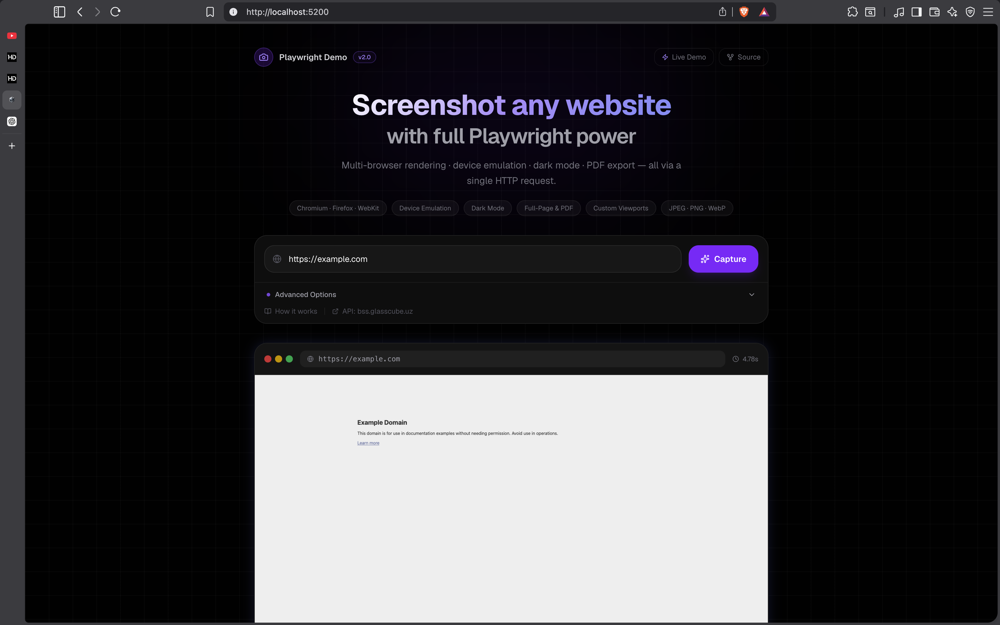
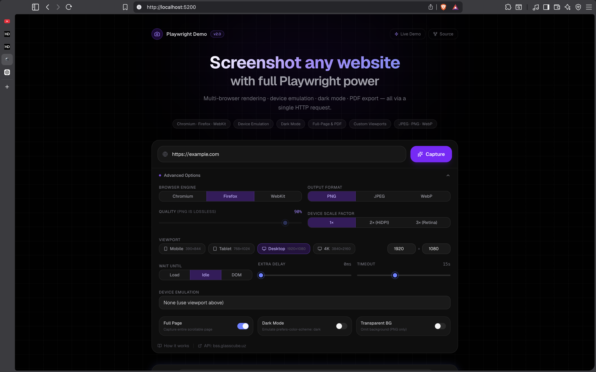
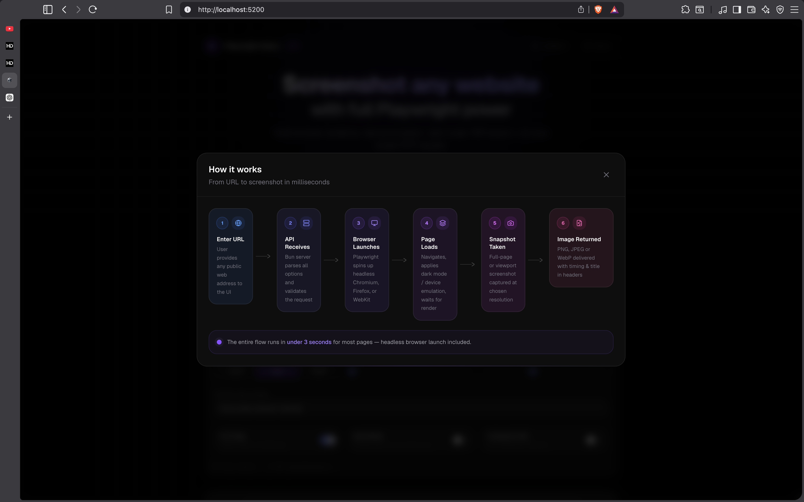
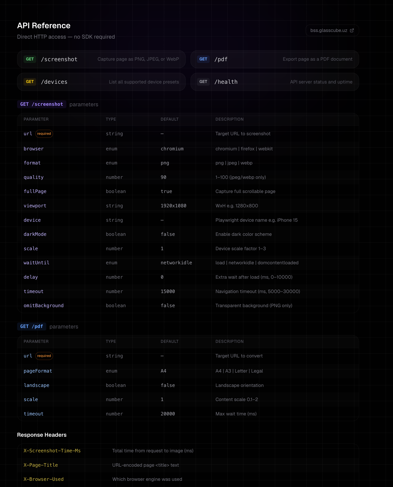

# Playwright Screenshot API

> A full-stack web screenshot service built to showcase the power of [Playwright](https://playwright.dev/) browser automation.

**Live UI** → [playwright.glasscube.uz](https://playwright.glasscube.uz)  
**Live API** → [bss.glasscube.uz](https://bss.glasscube.uz)  
**Source** → [github.com/glasscube/playwright-demo](https://github.com/glasscube/playwright-demo)

---

## What it does

Enter any public URL, configure capture options, and get back a pixel-perfect screenshot — all via a single HTTP request. The project exposes every major Playwright feature through a clean API and an interactive UI.

### Previews
<p align="center">
  
  
  
  
</p>

| Capability | Details |
|---|---|
| Multi-browser | Chromium, Firefox, WebKit |
| Device emulation | 100+ Playwright device presets (iPhone, Pixel, iPad…) |
| Output formats | PNG, JPEG (with quality), WebP |
| Full-page capture | Entire scrollable page or viewport-only |
| Dark mode | `prefers-color-scheme: dark` emulation |
| Custom viewports | Arbitrary width × height |
| Retina / HiDPI | 1×, 2×, 3× device scale factor |
| Wait strategies | `load`, `networkidle`, `domcontentloaded` |
| Extra delay | Configurable post-load wait (0–10 000 ms) |
| PDF export | A4 / A3 / Letter / Legal, portrait or landscape |
| Transparent background | `omitBackground` for PNG |
| Response metadata | Timing, page title, browser used in headers |

---

## Repository structure


```

playwright-demo/
├── api/          Bun + Playwright HTTP server
│   ├── index.ts          Routes: /screenshot /pdf /devices /health
│   ├── lib/utils.ts      screenshot() + generatePDF() helpers
│   ├── README.md         Full API reference
│   └── package.json
│
├── ui/           React + Vite frontend
│   ├── src/
│   │   ├── App.tsx           Main layout & state
│   │   ├── components/
│   │   │   ├── HowItWorksModal.tsx Framer Motion workflow animation
│   │   │   ├── AdvancedOptions.tsx All Playwright options panel
│   │   │   ├── ScreenshotPreview.tsx Browser-chrome result view
│   │   │   └── APIDocsSection.tsx  Inline API reference + code examples
│   │   └── index.css          shadcn dark theme + violet accent
│   ├── README.md           UI dev guide
│   └── package.json
│
└── README.md     ← you are here

```

---

## Quick start

### Prerequisites

- [Bun](https://bun.sh) ≥ 1.0
- Node ≥ 18 (for the UI build toolchain)
- Playwright browser binaries

### 1 — Install Playwright browsers

```bash
cd api
bun install
bunx playwright install chromium firefox webkit

```

### 2 — Start the API

```bash
cd api
bun run start
# → http://localhost:3000

```

### 3 — Start the UI

```bash
cd ui
npm install   # or: bun install
npm run dev
# → http://localhost:5200

```

---

## API quick reference

```bash
# Basic screenshot
curl "http://localhost:3000/screenshot?url=[https://example.com](https://example.com)"

# Firefox, dark mode, JPEG 85 %
curl "http://localhost:3000/screenshot?url=[https://example.com](https://example.com)&browser=firefox&darkMode=true&format=jpeg&quality=85"

# iPhone 15 Pro emulation
curl "http://localhost:3000/screenshot?url=[https://example.com](https://example.com)&device=iPhone+15+Pro"

# Export as PDF
curl "http://localhost:3000/pdf?url=[https://example.com](https://example.com)" --output page.pdf

# List all device presets
curl "http://localhost:3000/devices"

```

See [`api/README.md`](https://www.google.com/search?q=./api/README.md) for the full parameter reference.

---

## Tech stack

| Layer | Technology |
| --- | --- |
| Runtime | [Bun](https://bun.sh) |
| Browser automation | [Playwright](https://playwright.dev/) |
| Frontend framework | [React 19](https://react.dev/) + [Vite](https://vitejs.dev/) |
| Styling | [Tailwind CSS v4](https://tailwindcss.com/) |
| UI components | [shadcn/ui](https://ui.shadcn.com/) (Radix UI primitives) |
| Animations | [Framer Motion](https://www.framer.com/motion/) |
| Icons | [Lucide React](https://lucide.dev/) |
| Language | TypeScript |

---

## License

MIT
